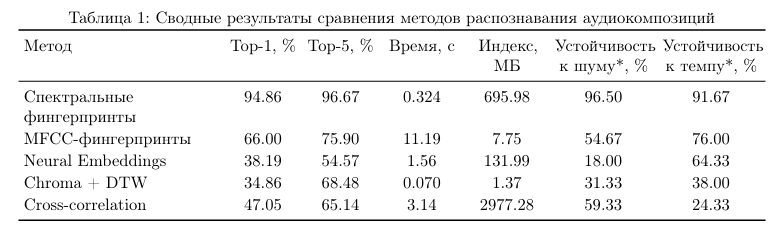
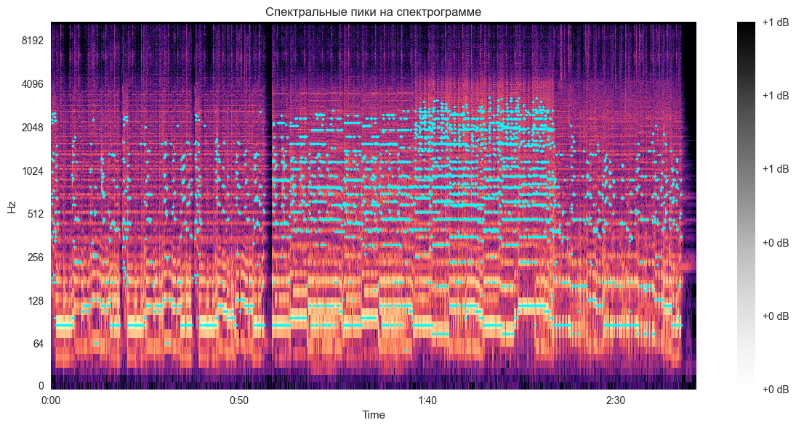
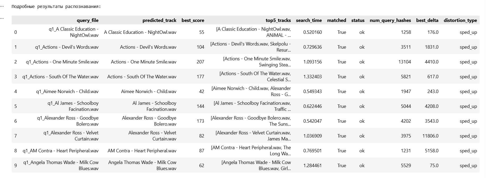
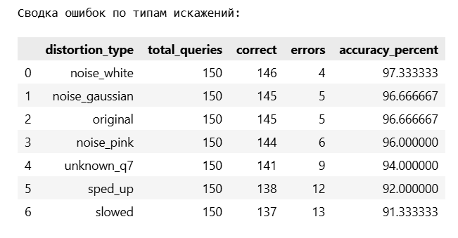

# Music Compositions Recognition Method

Этот репозиторий содержит Jupyter Notebook с реализацией модифицированного метода распознавания музыкальных произведений по коротким аудиофрагментам. Проект демонстрирует полный базовый сценарий работы: загрузку аудиоданных, предобработку сигнала, извлечение признаков, формирование аудиофингерпринтов, поиск совпадений и оценку качества распознавания.

## О проекте

Цель проекта — продемонстрировать работу метода распознавания музыкальных произведений на основе спектральных характеристик аудиосигнала. Основной сценарий реализован в одном Jupyter Notebook, который используется как воспроизводимый экспериментальный пайплайн.

Основной файл проекта:

`Modified_recognition_method.ipynb`

Ноутбук является центральной частью репозитория. Он содержит весь код, необходимый для демонстрации метода, и должен запускаться последовательно, сверху вниз. Отдельного приложения или набора Python-модулей в проекте нет: вся логика сосредоточена внутри ноутбука.

Ноутбук показывает:

- загрузку эталонной базы треков и тестовых запросов;
- предобработку аудиосигнала;
- построение спектрального представления;
- извлечение ключевых признаков;
- формирование и сопоставление аудиофингерпринтов;
- получение результата распознавания;
- расчёт метрик и визуализацию результатов.


## Почему в репозитории нет полного датасета

Полный набор аудиоданных, использованный в основном эксперименте, занимает несколько гигабайт. По этой причине он не загружается в GitHub-репозиторий целиком.

Вместо этого в репозитории размещена **сильно урезанная demo-база**, которая нужна только для демонстрации работы ноутбука и проверки воспроизводимости кода. В неё входят:

- несколько демо-треков в папке `data/tracks/`;
- несколько тестовых query-файлов в папке `data/query/`.

Такой формат позволяет:

- не перегружать репозиторий большими файлами;
- показать структуру проекта и базовый рабочий сценарий;
- проверить, что код выполняется корректно.

## Структура репозитория

```text
.
├── Modified_recognition_method.ipynb
├── requirements.txt
├── README.md
├── data/
│   ├── tracks/
│   │   ├── ...
│   ├── query/
│   │   ├── ...
│   └── images/
│       ├── ...
└── .github/
    └── workflows/
        └── ci.yml

```

## Установка и локальный запуск

Сначала нужно клонировать репозиторий:

```
git clone <repo_url>
cd <repo_name>
```

Далее рекомендуется создать виртуальное окружение и установить зависимости:

```
python -m venv .venv
source .venv/bin/activate
pip install -r requirements.txt
```
После этого можно открыть файл:

Modified_recognition_method.ipynb

Ноутбук следует выполнять последовательно, сверху вниз.

## Запуск через GitHub Actions

В репозитории настроен workflow GitHub Actions, который автоматически проверяет проект при push и pull request.

Файл workflow расположен по пути:

.github/workflows/ci.yml

Сценарий GitHub Actions выполняет следующие шаги:

клонирует репозиторий;
устанавливает Python и зависимости из requirements.txt;
подготавливает окружение для работы с ноутбуком;
запускает Modified_recognition_method.ipynb на урезанном demo-наборе данных;
завершает проверку, если ноутбук выполняется без ошибок.

Таким образом, GitHub Actions в этом проекте используется как механизм автоматической проверки воспроизводимости ноутбука.

## Метрики

В ноутбуке рассчитываются основные метрики качества распознавания, используемые для анализа работы метода. Пример сводной таблицы метрик приведён ниже.


## Пример результатов



## Пример вывода

Ниже приведены примеры изображений, демонстрирующих вывод результатов при выполнении ноутбука на обычном наборе данных.







## Примечание

Поскольку в репозитории используется только сокращённая demo-база, результаты, получаемые при запуске через GitHub Actions или локально из этого репозитория, предназначены именно для демонстрации корректной работы ноутбука. Полный эксперимент с основным датасетом выполнялся отдельно на полном наборе аудиоданных.
